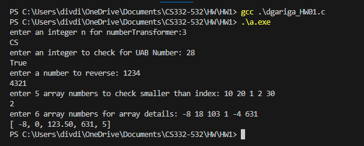

<!--
NOTES:
This is the README file home work assignment 1
-->

# Compilation Instructions

```bash
gcc -o dgariga_HW01 dgariga_HW01.c 
# this will compile the dgariga_HW01.c file and return an executable with the executable name dgariga_HW01.exe
```
# Run Instructions

```bash
.\dgariga_HW01.exe
#in Windows run the executable as shown
```

# Code Description

## Header Files:

#include<stdio.h>: Includes the standard input-output functions for reading and writing data.\
#include <stdbool.h>: Includes the header file for the boolean data type in C.
#include <stdlib.h>:I t is a preprocessor directive that includes the standard library header file "stdlib.h" in your C program


### Functions :


**bool isDivisibleBy3(int n)**:\
 this is a helper function to check if a number is divisible by 3.

A number is divisible by 3 if the sum of the digits of the number is divisible by 3.

The function enters a while loop that continues as long as n is not equal to zero meaning as long as there is no digit left.
Inside the loop, the last digit of n is obtained using the expression n % 10, and it is added to the sum.
The last digit is removed from n by performing n /= 10, which effectively moves to the next digit in the number.

After the loop completes, the function checks if the calculated sum is divisible by 3 (sum % 3 == 0).
The result of this check is then returned as a boolean value. If the sum is divisible by 3, the function returns true; otherwise, it returns false.

**bool isDivisibleBy5(int n)**:\
this is a helper function to check if a number is divisible by 5.

This code defines a function named isDivisibleBy5 that takes an integer n as its parameter and returns a boolean value. The purpose of the function is to determine whether the last digit of the input integer n is either 0 or 5, indicating divisibility by 5

**char *squareOfSum(int n)**:\
this is a helper function to return the square of sum of the digits of a number as string.

This code defines a function named squareOfSum that takes an integer n as its parameter and returns a dynamically allocated string. The purpose of the function is to calculate the square of the sum of the digits of the input integer n and represent the result as a string.

once the square of the sum of the digits is calculated, 
***char *resultString = (char *)malloc(50);*** : The function dynamically allocates memory for a character array (char *resultString) with a size of 50 using the malloc function.
This array is intended to hold the string representation of the square of the sum.
***snprintf(resultString, 50, "%d", square);***: The snprintf function is then used to convert the integer square to a string and store it in the dynamically allocated resultString and this returned from the function.

**bool isPowerOf2(int n)**:\
 this is a helper function to check if a number is a power of 2 or not.

if n is 0:  it cannot be represented as a power of 2, so we return false,
for other number it enters the while loop,
the logic here is, we continuosly try to check if a number is divisible by 2, if so we change n value to n/2 that means we removed one of the base number 2 and we do this until n becomes 1, thus its a power of 2. otherwise its not a power of 2.

**bool isPrime(int n)**: \
this is a helper function to check if a number is a prime number or not.

 The function begins by checking if the input n is less than or equal to 1.
If n is less than or equal to 1, the function immediately returns false because 1 and non-positive integers are not prime.
for numbers greater than 1, The function then enters a for loop that iterates from i = 2 to i<= square root of n.
Inside the loop, it checks if n is divisible evenly by i (i.e., n % i == 0).
If n is divisible by i, it means that n has a factor other than 1 and itself, indicating that n is not a prime number. In this case, the function returns false.
If the loop completes without finding any factor of n, the function concludes that n is a prime number, and it returns true.

**int nearestPrime(int n)**:\
this is a helper function to find the nearest prime number less than n.

The code defines a function named nearestPrime that takes an integer n as its parameter and returns the nearest prime number that is less than n. The function uses the isPrime function to check whether a number is prime, if its prime then it return i or it returns 0.

as we need to return the nearest prime number less than n, thats why we run the loop from, i=n-1 to i>=2.

**char *numberTransformer(int n)**:\
 this is the function which takes the integer n and return the string. 
and the output string varies depending on the condition.

**bool UABNumber()**: \
this is the function to check if a number is UABNumber or not. A number is UABNumber if the value of the number is equal to the sum of its positive divisors excluding the number itself.

The function prompts the user to enter an integer by displaying a message: "enter an integer to check for UAB Number."
The entered integer is stored in the variable n2.
If the entered integer n2 is 0, the function immediately returns false because 0 is not considered a UAB Number.

for other numbers,The function then enters a for loop that iterates from i = 1 to i < n2.
Inside the loop, it checks if n2 is divisible evenly by i (i.e., n2 % i == 0).
If i is a divisor of n2, it is added to the sum.
After calculating the sum of divisors, the function checks if the sum is equal to n2.

If the sum is equal to n2, it means that n2 is a UAB Number, and the function returns true; otherwise, it returns false.

**int reverseNum(int n3)**:\
The code defines a function named reverseNum that takes an integer n3 as its parameter and returns the reverse of that integer. The function uses a while loop to reverse the digits of the input number.

The function enters a while loop that continues as long as n3 is greater than 0.

Inside the loop, the last digit of n3 is obtained using the expression n3 % 10, and it is added to the reversed number reverse after being multiplied by 10 (shifting the current digits to the left).
The last digit is removed from n3 by performing n3 /= 10, which effectively moves to the next digit in the number.
Once the loop completes and all digits are reversed, the function returns the variable reverse containing the reversed number.

**int smallerThanIndex()**:\
The code defines a function named smallerThanIndex that takes no parameters and returns an integer. The purpose of the function is to count the number of elements in an array that are smaller than their respective indices.

The function prompts the user to enter 5 integer values for an array by displaying the message: "enter 5 array numbers to check smaller than index."
The entered values are stored in the array arr.

The function then enters a for loop that iterates through each element of the array.
Inside the loop, it checks if the value of the element arr[i] is less than the index i.
If the condition is true, it increments the count variable by 1.
After the loop completes, the function returns the final count, which represents the number of elements in the array that are smaller than their respective indices.

**void arrayDetails()**:\
The code defines a function named arrayDetails that performs various operations on an array of 6 integers. The function calculates and prints the minimum value, the index of the minimum value, the mean (average) of the array, the maximum value, and the index of the maximum value.

# Output screenshots


# github link
[Github link](https://github.com/divya-gariga/CS332-532/tree/main/HW/HW1)

# References
