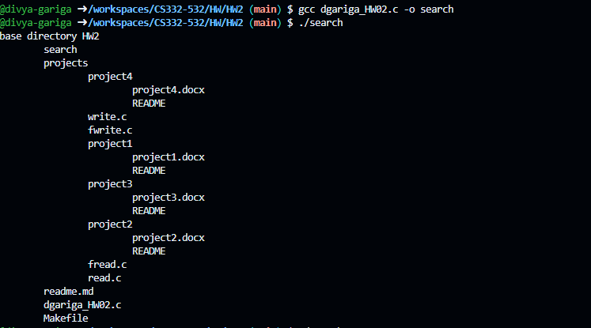
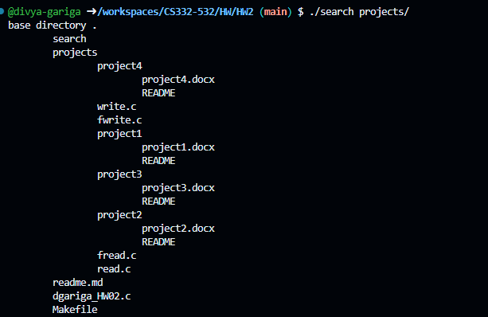
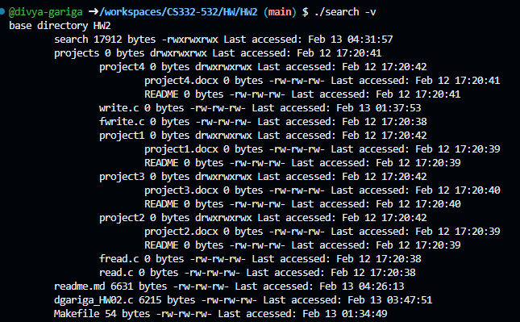
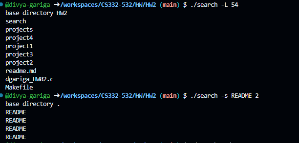
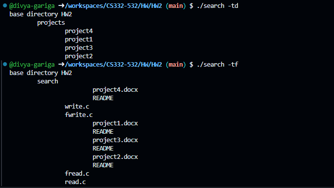

<!--
NOTES:
This is the README file home work assignment 2
-->

# Compilation Instructions

```bash
make 
# this will compile the dgariga_HW01.c file and return an executable with the executable name dgariga_HW01.exe
```
# Run Instructions

```bash
.\search
#in Windows run the executable as shown
```

# Code Description

### Functions :

## main function:
1. **Function Signature:**
   ```c
   int main(int argc, char **argv)
   ```
   The program starts with the `main` function, which is the entry point for any C program. It takes command-line arguments, where `argc` is the count of arguments, and `argv` is an array of strings containing the actual arguments.

2. **Variable Declarations:**
   ```c
   int option = 0;
   bool isVerbose = false;
   long fileSizeThreshold = -1;
   const char *searchString = NULL;
   int searchDepth = -1;
   char fileType = 'a';
   ```
   - `option`: Stores the result of `getopt` function, which is used for parsing command-line options.
   - `isVerbose`: A flag indicating whether the program should operate in verbose mode.
   - `fileSizeThreshold`: A threshold value for file size.
   - `searchString`: A string pattern to search for in files.
   - `searchDepth`: The depth to which the program should search for files.
   - `fileType`: Specifies the type of files to be considered.

3. **Command-line Option Parsing:**
   ```c
   while ((option = getopt(argc, argv, "vL:s:t:")) != -1)
   {
       switch (option)
       {
       // cases for different command-line options
       }
   }
   ```
   - This loop uses `getopt` to iterate through command-line options. The options specified are `-v`, `-L`, `-s`, and `-t`. Colons (`:`) after some options indicate that they expect an argument.

   - Inside the loop, a `switch` statement handles each option separately.

4. **Option Cases:**
   ```c
   switch (option)
   {
       case 'v':
           // Set verbose mode flag
           isVerbose = true;
           break;
       case 'L':
           // Set file size threshold
           fileSizeThreshold = atol(optarg);
           break;
       case 's':
           // Set search string and depth
           searchString = optarg;
           searchDepth = atoi(argv[optind]);
           break;
       case 't':
           // Set file type
           fileType = *optarg;
           break;
       default:
           // Handle invalid options
           fprintf(stderr, "Usage: %s [-v] [-L <file size>] [-s <string pattern> <depth>] [directory]\n", argv[0]);
           exit(EXIT_FAILURE);
   }
   ```
   - For each option, appropriate actions are taken, such as setting flags or extracting values.

5. **Processing the Remaining Command-line Arguments:**
   ```c
   if (optind == argc)
   {
       // No directory specified, use current directory
       // ...
   }
   else
   {
       // Directory specified, use it
       // ...
   }
   ```
   - Checks whether a directory is specified in the command line. If not, it uses the current directory.

6. **Executing the Main Logic:**
   ```c
   listFilesRecursively(".", 0, isVerbose, fileSizeThreshold, searchString, searchDepth, fileType);
   ```
   - Calls a function `listFilesRecursively` with the specified parameters to perform the main logic of listing files recursively.

7. **Return Statement:**
   ```c
   return 0;
   ```
   - Indicates successful completion of the program.

## listFilesRecursively:
1. **Open Directory and Error Handling:**
   ```c
   DIR *parentDir = opendir(basePath);
   if (parentDir == NULL)
   {
       perror("Error opening directory");
       exit(EXIT_FAILURE);
   }
   ```
   - Opens the directory specified by `basePath` using the `opendir` function.
   - Checks if the directory opening was successful, and if not, prints an error message and exits the program.

2. **Print Base Directory :**
   ```c
   if (depth == 0)
   {
       const char *dirName = basename(basePath);
       printf("base directory %s\n", dirName);
   }
   ```
   - If the current depth is 0 (i.e., the base directory), it prints the name of the base directory.

3. **Iterating Through Directory Entries:**
   ```c
   struct dirent *dirent;
   while ((dirent = readdir(parentDir)) != NULL)
   {
       // Check for "." and ".." entries
   }
   ```
   - Uses a `while` loop to iterate through each entry in the opened directory.
   - Skips entries with names "." and ".." to avoid processing the current and parent directory entries.

4. **Constructing Full Path and Obtaining File Information:**
   ```c
   char path[PATH_MAX_LENGTH];
   snprintf(path, sizeof(path), "%s/%s", basePath, dirent->d_name);
   struct stat fileStat;
   if (lstat(path, &fileStat) < 0)
   {
       perror("Error getting file information");
       exit(EXIT_FAILURE);
   }
   ```
   - Constructs the full path of the current entry using `basePath` and the entry's name.
   - Uses `lstat` to obtain information about the file, including its size and type.

5. **File Type Filtering and Verbose Output:**
   ```c
   if ((fileType == 'a') || (fileType == 'f' && S_ISREG(fileStat.st_mode)) || (fileType == 'd' && S_ISDIR(fileStat.st_mode)))
   ```
   - Checks if the file type matches the specified criteria (`fileType`). 'a' allows all types, 'f' allows regular files, and 'd' allows directories.

   ```c
   if (isVerbose)
   {
       // Verbose output: Print detailed information about the file
   }
   else
   {
       // Non-verbose output: Print file name based on specified options
   }
   ```
   - If in verbose mode, it prints detailed information about the file using the `printFileProperties` function.
   - If not in verbose mode, it checks various cases
   such as 
        i) Check if both -L and -s options are specified
        ii) Only -L option is specified
        iii) Only -s option is specified
        iv) if no option is specified.
   (`fileSizeThreshold`, `searchString`, `searchDepth`) and prints the file name accordingly.

6. **Recursively Process Directories:**
   ```c
   if (S_ISDIR(fileStat.st_mode))
   {
       listFilesRecursively(path, depth + 1, isVerbose, fileSizeThreshold, searchString, searchDepth, fileType);
   }
   ```
   - If the current entry is a directory, the function is called recursively to list its contents.
   - The `depth` parameter is incremented to track the depth in the directory tree.

7. **Closing the Directory:**
   ```c
   closedir(parentDir);
   ```
   - Closes the directory after processing all its entries.

# Output screenshots





# github link
[Github link](https://github.com/divya-gariga/CS332-532/tree/main/HW/HW2)

# References
https://man7.org/linux/man-pages/man3/getopt.3.html
