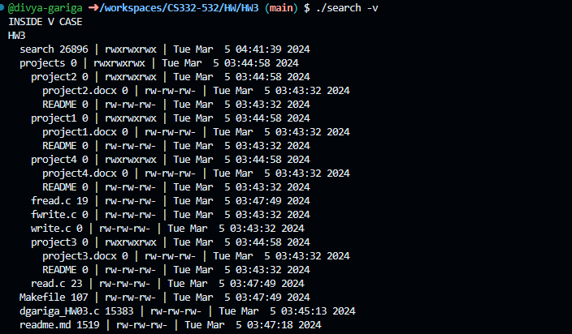
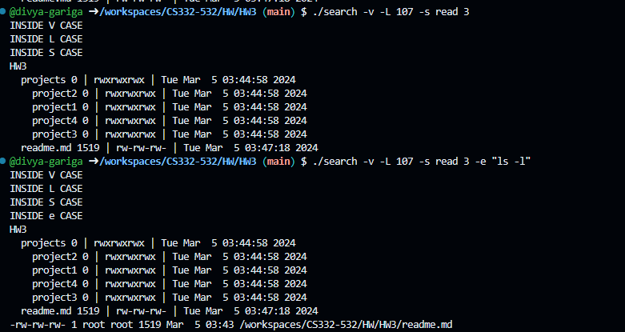
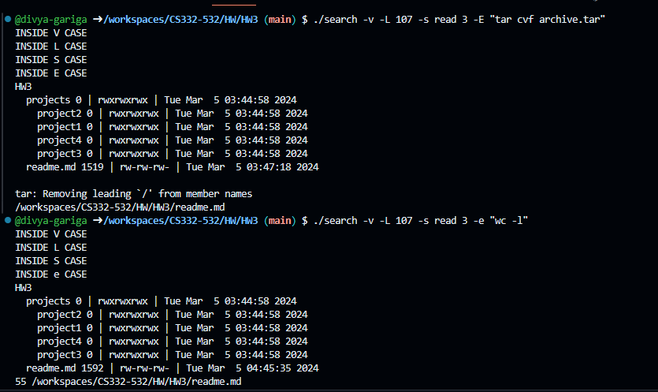

<!--
NOTES:
This is the README file home work assignment 3
-->

# Compilation Instructions

```bash
make 
# this will compile the dgariga_HW03.c file and return an executable with the executable name search.exe
```
# Run Instructions

```bash
make run ARGS="-v -e 'ls -l'"
#in Windows run the executable as shown
```

# Code Description

### Functions :
1.
  ```c
void print_permissions(mode_t mode, char *retPerms)
   ```
print_permissions that takes a mode_t value representing file permissions and a character array retPerms to store the corresponding permission string. The function utilizes bitwise operations to extract individual permission flags (read, write, and execute) for user, group, and others. It then maps these flags to the corresponding characters ('r', 'w', 'x') and constructs a permission string of the format "rwxrwxrwx". The resulting string is then copied into the retPerms array, providing a human-readable representation of file permissions.

2. 
```c
char *getSymLink(struct stat s, char *path)
```

The getSymLink C function facilitates the retrieval of the target path of a symbolic link. Upon verifying the path as a symbolic link using S_ISLNK, the function allocates memory for the link's target path, reads it using readlink, and stores the result in a dynamically allocated buffer. If successful, the function returns a pointer to the buffer containing the symbolic link's target path. In case of errors during the read operation, an error message is displayed, and allocated memory is freed.

3.
```c
char *getDetails(struct stat s, char *details, char *path)
```
The getDetails function in C generates a string containing file details such as size, permissions, and access time based on the provided file attributes. Memory is dynamically allocated for the details array, and the function utilizes the print_permissions function to format file permissions. The resulting information, including file size, permissions, and access time, is stored in the details array, which is then returned for further use. Proper memory management is crucial to prevent memory leaks when using this function

4.
```c
void choosePrint(struct stat s, char *currentPath, char *details, int det)
```
The `choosePrint` function in C selectively prints information about a file, considering symbolic links and detailed information. It checks if the file is a symbolic link, retrieves the link target, and prints the directory name along with optional link details. The function offers flexibility, allowing users to control the display of symbolic link information and detailed file attributes.

5.
```c
void executeUnixCommand(char *fileName, const char *commandString) 
```
The executeUnixCommand function in C facilitates the execution of a given Unix command on a specified file. It first creates a copy of the command string for tokenization, using dynamic memory allocation. The function then tokenizes the command string, adding the filename as the last argument and ensuring a NULL pointer termination for exec functions. Subsequently, the function forks a new process and utilizes execvp in the child process to execute the command with its arguments.

The parent process waits for the child process to terminate, handling normal and abnormal termination scenarios using the wait function. If the child process terminates normally, the function prints the exit status. In case of abnormal termination, an appropriate message is printed. Error handling includes checking for fork failures and using perror to display system error messages. The allocated memory for the command copy is freed to avoid memory leaks.

6.
```c
void executeUnixCommandWithE() 
```
The `executeUnixCommandWithE` function in C is designed to execute a specified Unix command for each matched file when the `-E` argument is provided. It begins by creating a copy of the command string for tokenization and dynamically allocates memory to store it. The function then tokenizes the command string, adding each matched filenames of search criteria as an argument. After ensuring a NULL pointer termination for exec functions, it forks a new process. In the child process, the command is executed using `execvp` with its arguments.

The parent process waits for the child to terminate, handling normal and abnormal termination scenarios. If the child process terminates normally, the function prints the exit status. In case of abnormal termination, an appropriate message is displayed. Error handling includes checking for fork failures and utilizing `perror` to display system error messages. The memory allocated for the command copy is freed to prevent memory leaks.

7.
```c
void search(char *path, int indent, char **flagArgs, int numFlags)
```
The `search` function in C recursively explores a specified directory, examining each file and subdirectory. It utilizes the `opendir` function to open the directory, handling potential errors. The function iterates through the directory entries using `readdir`, obtaining file details and checking against various user-specified flags. For directories, it prints indentation based on the recursion depth, retrieves and prints details if required, and recursively calls itself for subdirectories. For files, it checks against flags, accumulates matching files, prints details if necessary, and executes a Unix command output if the `-e` flag is present. The function concludes by closing the directory using `closedir`.


8.
```c
int main(int argc, char **argv)
```

The main function orchestrates a flexible file search operation based on user-provided command-line arguments. It initializes essential variables, such as the currentCommand structure, which encapsulates the search path, modified arguments, and flag details. Leveraging the getopt function, it parses command-line options, dynamically allocates memory for flag arguments, and interprets user directives for constructing the search path. The function handles various cases, ensuring proper validation of arguments and comprehensive error handling. If no search path is specified, it defaults to using the current working directory. After extracting the base directory name, the search function is invoked, initiating a recursive exploration of the file system based on user-defined flags and search criteria.

# Output screenshots




# github link
[Github link](https://github.com/divya-gariga/CS332-532/tree/main/HW/HW3)

# References
1.taken reference of hw2 solution provided in the resources of hw3
2.https://man7.org/linux/man-pages/man3/getopt.3.html
