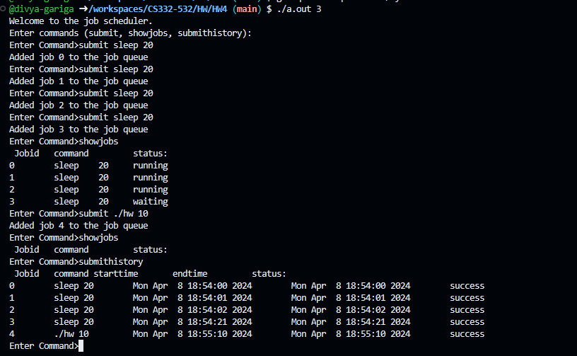
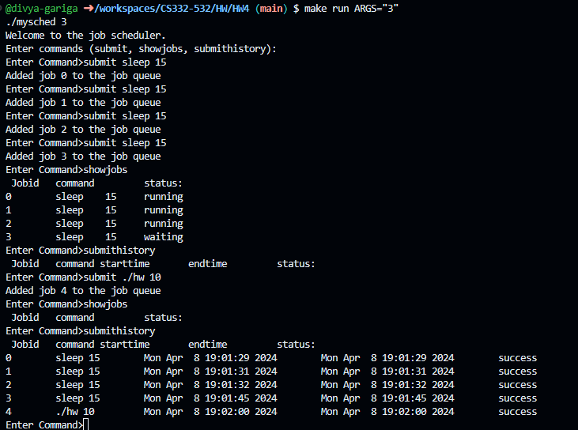

<!--
NOTES:
This is the README file home work assignment 4
-->

# Compilation Instructions

```bash
make 
# this will compile the dgariga_and_vpancha2_HW04.c file and return an executable with the executable name mysched.exe
```
# Run Instructions

```bash
make run ARGS="3"
#in Windows run the executable as shown
```

### Division of Assignment work:

### Divya Gariga : 
1.**Implementing the job scheduler:**
   Integrated the queue,and implemented job manager function which continuously checks the queue for pending jobs and executes them concurrently.

2.**Implementing the commands(submit):**
  implemented the submit command flow, by creating job, inserting it into the queue, and creating the process by using **execute_job** function.

### Vaishnavi Panchalingala: 
1.**Parsing and interpreting the commands (including command-line arguments)**: implement the main loop for handling user input commands.
2.**Implementing the commands(show_jobs,submit_history):**
  Developed the show_jobs, submit_history functions

# Code Description

### Functions :

1. **getCurrentDateTime()**: This function returns the current date and time.

2. **execute_job(void *arg)**: This function is executed by each thread to execute a job. It forks a child process to execute the job's command. If the fork fails, it prints an error message. Otherwise, in the child process, it redirects the standard output and error to files, parses the command and its arguments, and executes the command using `execvp()`. If `execvp()` fails, it prints an error message and exits with failure status. In the parent process, it waits for the child process to terminate, updates the end time of the job, and sets the job status to "success" if the child process terminated normally.

3. **show_jobs(int n)**: This function prints the job ID, command, arguments, and status of the jobs that are either running or waiting. It iterates through the array of jobs and prints the details of each job whose status is not "success".

4. **submit_history(int n)**: This function prints the job ID, command, start time, end time, and status of the jobs that have completed successfully. It iterates through the array of jobs and prints the details of each job whose status is "success".

5. **create_job(char *command, char *arguments, int jobId)**: This function creates a new job with the given command, arguments, and job ID. It initializes the job's status to "waiting" and sets its start and end times to the current time.

6. **job_manager(void *arg)**: This function is executed by a separate thread to manage job execution. It continuously checks the queue for pending jobs and executes them if the number of running jobs is less than the maximum allowed concurrent jobs (`p`). If there are no pending jobs or the maximum concurrent jobs limit has been reached, it sleeps for a while before checking again.

7. **main(int argc, char *argv[])**: The main function initializes the queue, creates the job manager thread, and then enters a loop to process user commands. It supports three commands: "submit" to submit a new job to the queue, "showjobs" to display the details of running or waiting jobs, and "submithistory" to display the details of completed jobs. If the user provides a command line argument specifying the maximum concurrent jobs (`p`), it is used; otherwise, the default value of 1 is used.

These functions together form a job scheduler program that allows users to submit, monitor, and view the status of jobs.

# Output screenshots
### without using make file

### using make file


# github link
[Github link](https://github.com/divya-gariga/CS332-532/tree/main/HW/HW4)

