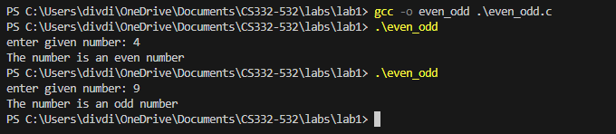

<!--
NOTES:
This is the README file for even or odd C program
-->

# Compilation Instructions

```bash
gcc -o even_odd even_odd.c 
# this will compile the even_odd.c file and return an executable with the executable name even_odd.exe
```
# Run Instructions

```bash
.\even_odd.exe
#in Windows run the executable as follows
```

# Code Description

## Header Files:

#include<stdio.h>: Includes the standard input-output functions for reading and writing data.\
#include <stdbool.h>: Includes the header file for the boolean data type in C.

### Function:

**bool isEven(int n)** :Is a function named isEven that takes an integer n as a parameter and returns a boolean value (true if n is even, false otherwise).

### Main Function:

**int main()**: The main function is the entry point of the program.
It Declares an integer variable given_number to store the user input.
**printf("enter a number: ");** : Prompts the user to enter a number.
**scanf("%d", &given_number);** : Reads the user input and stores it in the variable given_number.
**if(isEven(given_number))** : Calls the isEven function with the user-provided number as an argument. If the result is true, it executes the block inside, indicating that the number is even.
else: If the result is false, it executes the block inside, indicating that the number is odd.

# Output screenshots


# github link

[Github link](https://github.com/divya-gariga/CS332-532/tree/main/labs/lab1)

# References
I have referred lab1 resources provided for my lab assignment 
https://uab.instructure.com/courses/1621990/files/73358477?wrap=1
