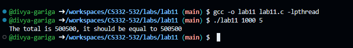

<!--
NOTES:
This is the README file for lab11
-->

# Compilation Instructions

```bash
gcc -o lab11 lab11.c -lpthread
# this will compile the lab11.c file and return an executable with the executable name lab11.exe
```
# Run Instructions

```bash
.\lab11.exe
#in Windows run the executable as shown
```

# Code Description

**Prerequisites:**
The program requires standard C library headers such as `stdio.h`, `stdlib.h`, `pthread.h`, and `unistd.h`.

**Global Variables:**
A mutex lock named `mutex` is declared to synchronize access to shared resources among threads.

**Structures:**
The `ThreadArgs` structure holds information about the vector and thread-specific data, facilitating thread execution.

**Function: `void *compute(void *arg)`**
This function is executed by each thread to compute the partial sum of vector elements assigned to it based on its identifier and vector size. The partial sum is added to the global sum using mutex locks to ensure thread safety.

**Function: `int main(int argc, char **argv)`**
Serving as the entry point of the program, this function parses command-line arguments to determine vector size and the number of threads. It allocates memory for the vector and thread arguments, creates threads, assigns each its portion of the vector, waits for threads to complete, computes the total sum by aggregating partial sums, and prints the result along with the expected sum for validation. Memory deallocation is performed before program termination to prevent memory leaks.


## output screenshots:


# github link
[Github link](https://github.com/divya-gariga/CS332-532/tree/main/labs/lab11)
