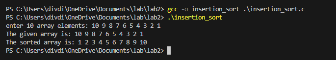

<!--
NOTES:
This is the README file for insertion sort C program
-->

# Compilation Instructions

```bash
gcc -o insertion_sort insertion_sort.c 
# this will compile the insertion_sort.c file and return an executable with the executable name insertion_sort.exe
```
# Run Instructions

```bash
.\insertion_sort.exe
#in Windows run the executable as shown
```

# Code Description

#include<stdio.h>: Includes the standard input-output functions for reading and writing data.

#define ARRAY_SIZE 10: This is a preprocessor directive that defines a macro named ARRAY_SIZE with a value of 10. In this case, ARRAY_SIZE is a constant representing the size of an array.

### Main Function:

The main function is the entry point of the program.
The program creates an array of length 10 and prompts user to input 10 array elements and stores those elements in array.

insertion sort:
the insertion sort logic is to place an element i.e., key at its correct position by comparing with the elements present on its left side, if the elements are greater than the key element then they are shifted to one step ahead leaving the place for the key element.

The program starts for loop at position 1 to the Array length - 1, and consider element at position 0 is sorted array and for each iteration it selects an element a[i] as key and compares with the left side of elements starting from j=i-1 to j=0 (sorted array ), if the key is less than its preceding element j then shift the  element to one position ahead (j+1) and then decrement j and continue this loop until we find correct position of key element in the sorted array and assign the key element to a[j+1]
continue this procedure for other elements in the array, consider the other elements as key and place it in its correct position.

Finally after the insertion sort it prints the sorted array.

# Output screenshots


# github link
[Github link](https://github.com/divya-gariga/CS332-532/tree/main/labs/lab2)

# References
I have referred lab2 resources provided for my lab assignment 
