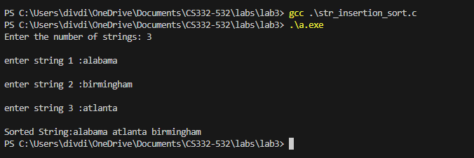

<!--
NOTES:
This is the README file for insertion sort C program
-->

# Compilation Instructions

```bash
gcc -o str_insertion_sort str_insertion_sort.c 
# this will compile the str_insertion_sort.c file and return an executable with the executable name str_insertion_sort.exe
```
# Run Instructions

```bash
.\str_insertion_sort.exe
#in Windows run the executable as shown
```

# Code Description

# Headers:

#include<stdio.h>: Includes the standard input-output functions for reading and writing data.

#include<string.h>: It is a standard header file that provides various functions for working with strings.

#include<stdlib.h>: It is a header in C stands for "standard library" and provides several general-purpose functions involving memory allocation.

#define MAX_STRING_LENGTH 10: This is a preprocessor directive that defines a macro named MAX_STRING_LENGTH with a value of 100. In this case, MAX_STRING_LENGTH is a constant representing the size of an string array.

# Functions:
   1. readArrayofStrings: Takes an integer 'n' as input and reads 'n' strings from the user,
                          dynamically allocating memory for each string.

   2. insertionSort: Performs the insertion sort algorithm on an array of strings.
                     Sorts the strings lexicographically in ascending order.

   3. displayStrings: Displays the sorted array of strings.

   4. freeStrings: Frees the dynamically allocated memory for an array of strings.

   5. main: The main function of the program. It prompts the user to enter the number of strings,
            reads the strings, performs sorting, displays the sorted strings, and frees memory.

# Output screenshots


# github link
[Github link](https://github.com/divya-gariga/CS332-532/tree/main/labs/lab3)

