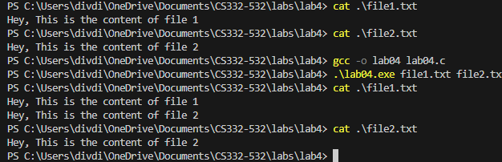

<!--
NOTES:
This is the README file for lab04 
-->

# Compilation Instructions

```bash
gcc -o lab04 lab04.c 
# this will compile the lab04.c file and return an executable with the executable name lab04.exe
```
# Run Instructions

```bash
.\lab04.exe
#in Windows run the executable as shown
```

# Code Description

# Headers:

#include<stdio.h>: Includes the standard input-output functions for reading and writing data.

#include<string.h>: It is a standard header file that provides various functions for working with strings.

#include<stdlib.h>: It is a header in C stands for "standard library" and provides several general-purpose functions.

#include <fcntl.h>: File control options, including file opening modes.

#define BUFFER_SIZE 4096: This is a preprocessor directive that defines a macro named BUFFER_SIZE with a value of 4096. In this case, BUFFER_SIZE is a constant representing the size of an buffer.

# Function main():
 # Parameters: 
              int argc: Number of command-line arguments.
              char *argv[]: Array of command-line arguments.
 # Command-Line Argument Validation:
      if (argc != 3): Checks if the correct number of command-line arguments (source and destination filenames) is provided, otherwise program exits.
      if (strcmp(argv[1], argv[2]) == 0): Ensures that source and destination filenames are different.

**open(argv[2], O_RDONLY)**:  
Use the open function in read only mode to read the input file name provided in the command line argument. 

**open(argv[1], O_WRONLY | O_CREAT | O_APPEND, 0700)**: 
 Use the open function in O_WRONLY | O_CREAT | O_APPEND mode to open the file in append mode, if no file exists with the filename provided then a new file will be created with file permissions 0700(providing read, write and execute permissions for the owner of the file).

**if (sourceFileDescriptor == -1 || destinationFileDescriptor == -1)**: 
This block of code checks whether there was an error opening either the source file (sourceFileDescriptor) or the destination file (destinationFileDescriptor). If either file descriptor is equal to -1, it means that the corresponding file could not be opened. In such a case, the program prints an error message, indicating that there was an issue opening the file, and then exits with a status code of -1, indicating an error.

**write(destinationFileDescriptor, "\n", 1) != 1**: Here, the program writes a newline character ("\n") to the destination file using the write system call.

```c
 while ((n = read(sourceFileDescriptor, buffer, sizeof(buffer))) > 0)
    {
        if (write(destinationFileDescriptor, buffer, n) != n)
        {
            printf("Error writing to destination file");
            exit(-1);
        }
    }
```
finally in the while loop, code reads from the source file in chunks (buffered read) using the read system call and appends the read content to the destination file using the write system call. The loop continues until the end of the source file is reached (when read returns 0). If there is an error during the write operation, it prints an error message and exits the program with a status code of -1. 

**close(sourceFileDescriptor),close(destinationFileDescriptor)** : close the file descriptors, otherwise it might lead to  resource leaks.

# Output screenshots


# github link
[Github link](https://github.com/divya-gariga/CS332-532/tree/main/labs/lab4)

