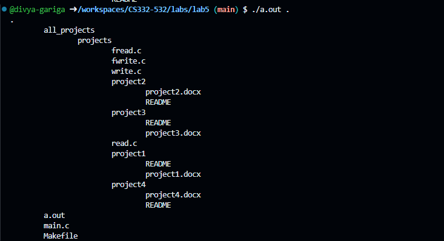

<!--
NOTES:
This is the README file for lab05
-->

# Compilation Instructions

```bash
gcc -o main main.c 
# this will compile the main.c file and return an executable with the executable name main.exe
```
# Run Instructions

```bash
.\main.exe
#in Windows run the executable as shown
```

# Code Description

# Functions
# main():
 # Parameters: 
              int argc: Number of command-line arguments.
              char *argv[]: Array of command-line arguments.
 **Executing the Main Logic:**
   ```c
   listFilesRecursively(argv[1], 0);
   ```
   - Calls a function `listFilesRecursively` with the specified parameters to perform the main logic of listing subdirectories and files recursively.
# listFilesRecursively:
1. **Open Directory and Error Handling:**
   ```c
   DIR *parentDir = opendir(basePath);
   if (parentDir == NULL)
   {
       perror("Error opening directory");
       exit(EXIT_FAILURE);
   }
   ```
   - Opens the directory specified by `basePath` using the `opendir` function.
   - Checks if the directory opening was successful, and if not, prints an error message and exits the program.

2. **Print Base Directory :**
   ```c
   if (depth == 0)
   {
       const char *dirName = basename(basePath);
       printf("base directory %s\n", dirName);
   }
   ```
   - If the current depth is 0 (i.e., the base directory), it prints the name of the base directory.

3. **Iterating Through Directory Entries:**
   ```c
   struct dirent *dirent;
   while ((dirent = readdir(parentDir)) != NULL)
   {

   }
   ```
   - Uses a `while` loop to iterate through each entry in the opened directory.
   - Skips entries with names "." and ".." to avoid processing the current and parent directory entries.

4. **Constructing Full Path and Obtaining File Information:**
   ```c
   char path[PATH_MAX_LENGTH];
   snprintf(path, sizeof(path), "%s/%s", basePath, dirent->d_name);
   struct stat fileStat;
   if (lstat(path, &fileStat) < 0)
   {
       perror("Error getting file information");
       exit(EXIT_FAILURE);
   }
   ```
   - Constructs the full path of the current entry using `basePath` and the entry's name.
   - Uses `lstat` to obtain information about the file, including its size and type.
5. ** print :**
```c
   for (int i = 0; i <= depth; i++)
                    {
                        printf("\t");
                    }
                    printf("%s\n", dirent->d_name);
```
  - print the directory or filename with tab space before for indendation
5. **Recursively Process Directories:**
   ```c
   if (S_ISDIR(fileStat.st_mode))
   {
       listFilesRecursively(path, depth + 1);
   }
   ```
   - If the current entry is a directory, the function is called recursively to list its contents.
   - The `depth` parameter is incremented to track the depth in the directory tree.

6. **Closing the Directory:**
   ```c
   closedir(parentDir);
   ```
   - Closes the directory after processing all its entries.


# Output screenshots

# github link
[Github link](https://github.com/divya-gariga/CS332-532/tree/main/labs/lab5)

