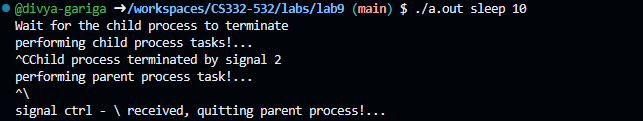
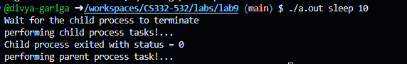

<!--
NOTES:
This is the README file for la9b0
-->

# Compilation Instructions

```bash
gcc -o main main.c 
# this will compile the main.c file and return an executable with the executable name main.exe
```
# Run Instructions

```bash
.\main.exe
#in Windows run the executable as shown
```

# Code Description

# Functions
## Includes: 
The program includes necessary header files for standard I/O, process management, and signal handling.

## Global Variables:
 child_pid is declared as a global variable to store the PID of the child process.

## Signal Handlers:

sigint_handler: Handles the SIGINT signal (Ctrl+C). It ignores SIGINT in the parent process 
sigtstp_handler: Handles the SIGTSTP signal (Ctrl+Z). It ignores SIGTSTP in the parent process
sigquit_handler: Handles the SIGQUIT signal (Ctrl+). It quits the parent process if it receives SIGQUIT.

## Main Function:

Signal handlers are installed using the signal function for SIGINT, SIGTSTP, and SIGQUIT.
Command-line arguments are checked to ensure the program is invoked correctly.
The program forks a child process using fork.
# In the child process:
It prints a message indicating that it's performing child process tasks.
It executes the command passed as arguments using execvp.
If execvp fails, an error message is printed, and the child process exits with failure.
## In the parent process:
The child PID is stored in child_pid.
SIGINT and SIGTSTP signals are ignored in the parent process.
SIGQUIT is handled by the sigquit_handler.
The parent process waits for the child process to terminate using wait.
If the child process exits normally, the exit status is printed.
If the child process is terminated by a signal, the signal number is printed.
A message indicating that the parent process task is performed is printed.
The parent process sleeps for 10 seconds before exiting.

## output screenshots:

normal execution:


# github link
[Github link](https://github.com/divya-gariga/CS332-532/tree/main/labs/lab9)
